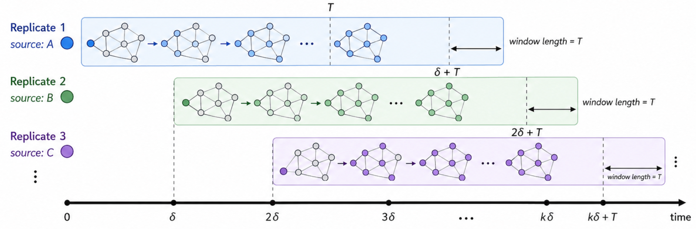
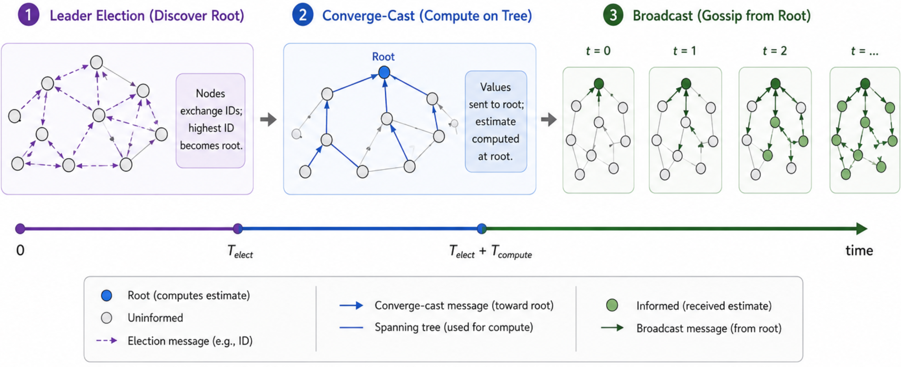
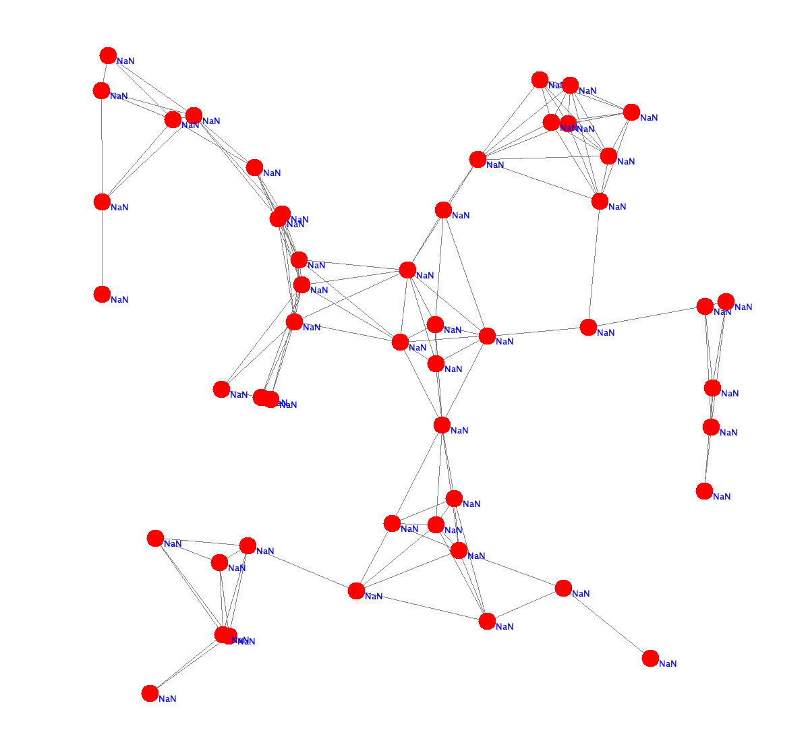
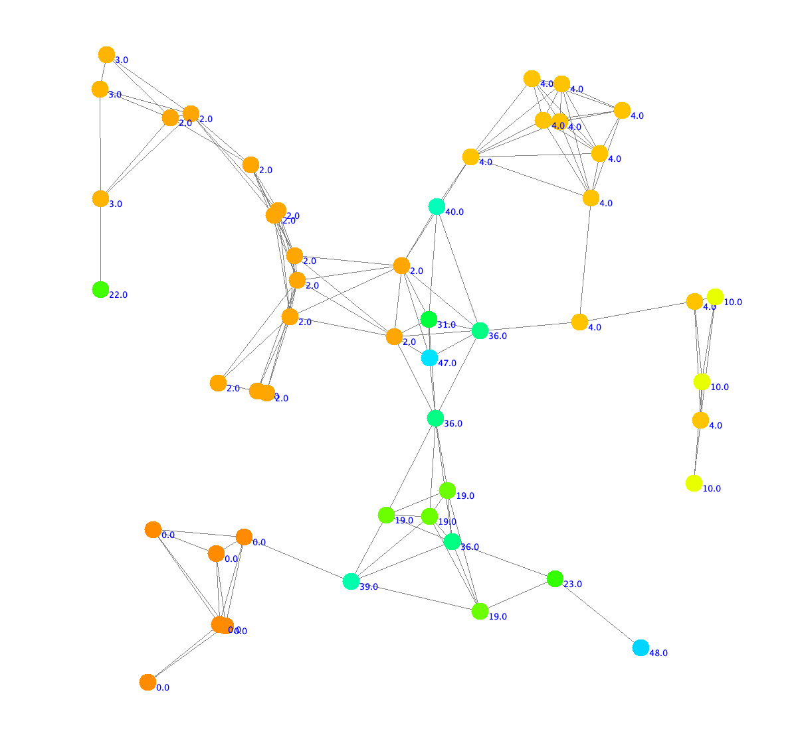
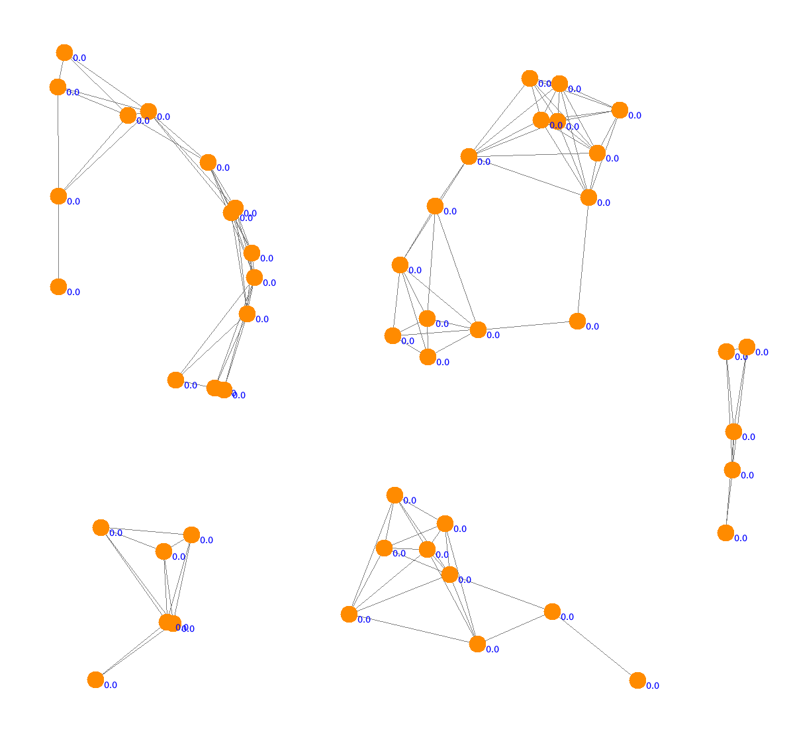
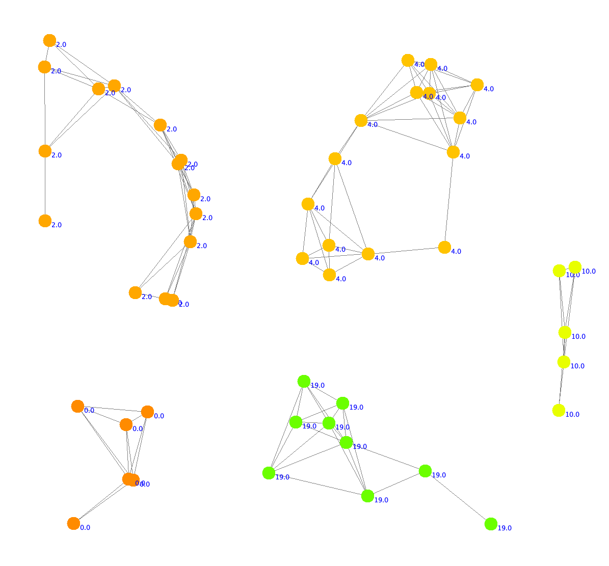
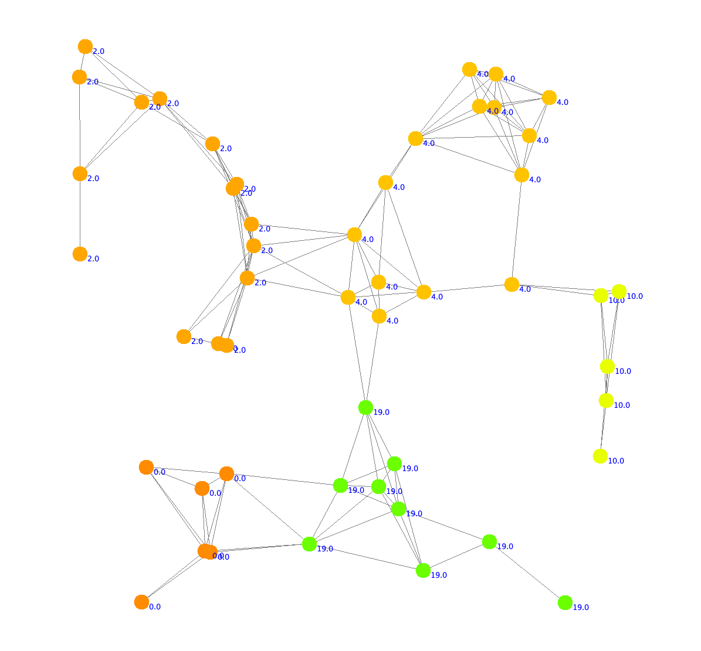
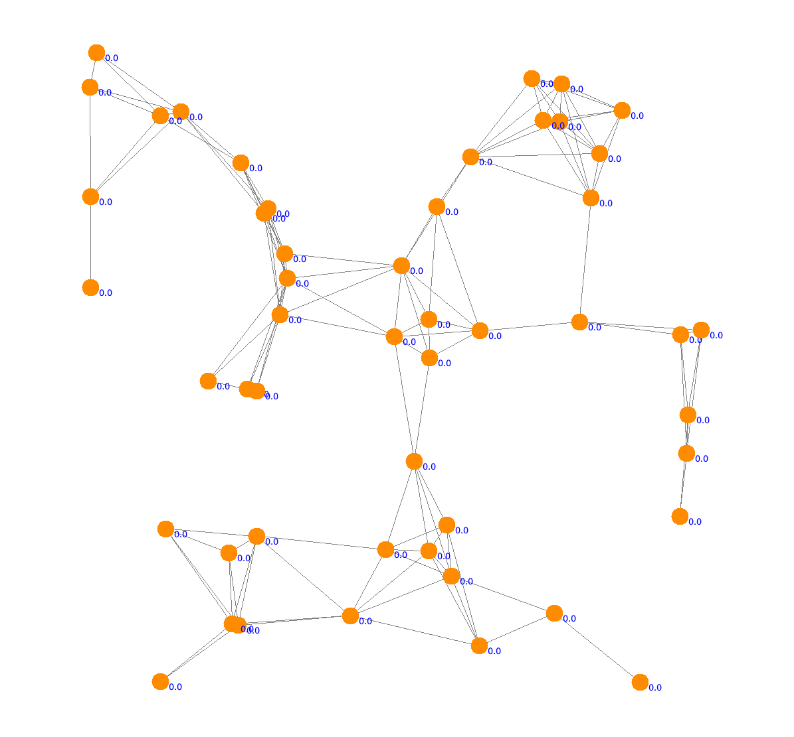
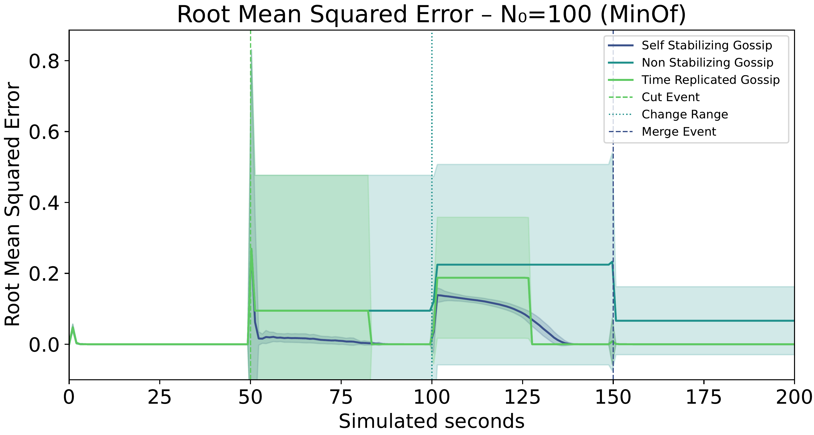
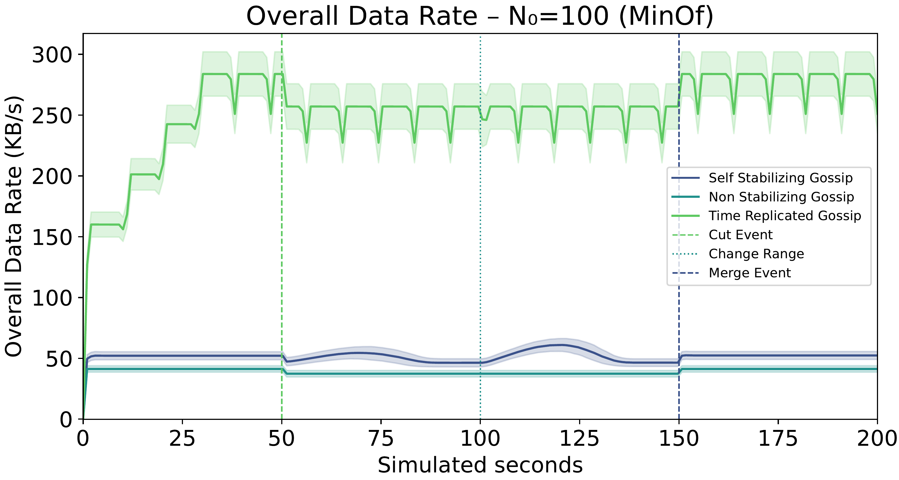

+++

title = "A Self-Stabilizing Min-Max Consensus via Path-loop Detection"
description = "Pre-initialized slides from the paper summary"
outputs = ["Reveal"]

+++

# A Self-Stabilizing Min-Max Consensus via Path-loop Detection

### [Angela Cortecchia](angela.cortecchia@unibo.it), [Danilo Pianini](danilo.pianini@unibo.it), [Mirko Viroli](mirko.viroli@unibo.it)

---

## Context: gossip algorithms

Gossip algorithms are a popular class of *decentralized protocols* for information *dissemination* and *aggregation* in distributed systems.

Network nodes converge to a common value by repeatedly exchanging and merging their local state with neighbors.

Gossip algorithms merge values using functions that are:
- **idempotent**: $f(x, f(x, y)) = f(x, y)$, and
- **commutative**: $f(x, y) = f(y, x)$.

### Problem at hand

- Gossip is scalable and decentralized, but **monotonic**
    - values can only adjust in one direction
    - Once a stale or corrupted “best” value appears, it can persist forever
    - Gossip protocols are inherently **asymmetric**
- In other words, classic gossip is **not self-stabilizing** (cf. Dijkstra 1974¹)

> **Self-stabilization** is the ability of a system to recover from arbitrary transient faults, eventually converging to a correct state without external intervention.

<small>1. *Self-stabilizing systems in spite of distributed control* https://dl.acm.org/doi/10.1145/361179.361202</small>

---

## Gossip algorithms: the curse of monotonicity

Mini-simulation: find the *minimum* value in the (local) network.

We'll expand the communication radius, then reduce it



Desiderata: the minimum value should be found, when the network changes, the system should *recover* and find the new minimum.

---

## Common workarounds

### Restart-gossip

A strategy to recover from stale values is to **periodically reset the system**
- Requires global *synchronization* or logical *timestamps*
- *Stability* vs *adaptivity* trade-off (oscillatory behavior)
- Non-self-stabilizing by design



---

### Time-replication

Maintain **multiple parallel gossip instances**, use the oldest replica as current, discard replicas after a timeout.
- Requires a "pace-making" mechanism
- Trades off *promptness* and communication *overhead* to achieve *self-stabilization*
- Requires *fine-tuning of hyperparameters* (number of replicas, timeout duration)

---

### Converge-cast + broadcast

Elect a **leader**, build a spanning tree, **aggregate values up** to the root, **broadcast** result down.
- Leader election and tree maintenance are costly and fragile in dynamic networks

---

## Gossip vs. min-max consensus (aka selector-based consensus)

Min-max consensus is a *special case* of gossip where the correct value depends **on a single input**, e.g., minimum or maximum selection.

In addition to *commutativity* and *idempotence*, the function must also be **selective**: $f(x, y) \in \\{x, y\\}$.

### Intuition

- In min-max consensus, the "best" value is determined by a single node's input
- We can track the "path" of support for a value
  - This is similar to the spanning tree in converge-cast, but without a fixed leader or global structure
- If the local device appears in the path of a candidate value, it can reject it as stale (**loop detection**)

---

## Algorithm:

1. messages are in the form `(value, list of device ids)`. Start with `(local value, [local device id])`
2. observe the values shared by neighbors, *discard all those whose list contains your device id* (loop detection)
3. *select the best* value among the remaining candidates and your local one
   - *tie-breaking* by shortest path and deterministic ID-based rule
4. *share the selected* value with *your device id appended* to the list



---

## Under the hood



---

## Why stale values disappear

- *Unsupported values are not regenerated* by any local source
- *Propagation in finite components eventually causes loops* or loss against valid candidates
- Loop detection + deterministic selection prunes obsolete information

## Implementation in aggregate computing

- Fully decentralized
- No global clocks
- No periodic global reset
- No leader election or collection tree
- Asynchronous and local interactions only

---

## Self-stabilization proof

We prove self-stabilization after the environment stabilizes.

- Each connected component contains a *finite set* of devices $\mathcal D$
- Device identifiers are totally ordered
- Each device keeps only the last value received from each neighbor
- Local inputs and neighborhood relations eventually stop changing

### Proof idea

- We show that the aggregate computing implementation of algorithm is an instance of the **minimizing-share** self-stabilizing pattern
- Total order on device identifiers induces a total order on gossip values
- The addition of the current device identifier to the path ensures monotonicity and progressiveness

## Consequences

1. **Loop-freedom**: a candidate cannot be accepted after re-entering a device already in its path
    - holds because a device never selects a candidate whose path already contains its own identifier
1. **Stale information pruning**: unsupported candidates are eventually removed
    - holds because, once stabilized, unsupported candidates are no longer regenerated locally, while progressive path extension cannot continue indefinitely in a finite component without eventually being rejected by the sanitizer.
1. **Convergence**: remaining candidates converge to the best value in each connected component
    -  holds because the minimizing-share result guarantees stabilization to the ≤-minimum candidate

---

## Evaluation setup

{}
{}

{}
{}

{}
{}

{}
{}

{}
{}

{}
{}

{}
{}

{}
{}

- Simulated in **Alchemist**¹, experiments are open source and available²
- Random 2D deployments in a square arena, asynchronous rounds (1 Hz), unit-disk communication with range $R$
- **Dynamics**: We let the system stabilize, then perturb it by changing the topology (inducing segmentation), then changing the local values, and finally removing the segmentation.
- **Baselines**: non-self-stabilizing gossip and time-replicated gossip
- **Metrics**:
    - RMSE from oracle expected value
    - Communication data rate

<small>1. [https://alchemistsimulator.github.io](https://alchemistsimulator.github.io)</small>
 
<small>2. [https://bit.ly/3OnjCQA](https://bit.ly/3OnjCQA)</small>

---

## Performance

---

## Network cost

---

## Conclusion

- We presented a *self-stabilizing min-max consensus* algorithm based on *path-loop detection*
- The algorithm is fully decentralized, asynchronous, and does not require global synchronization or leader election
- We *proved self-stabilization*
- We compared with time-replicated gossip and showed *comparable convergence speed* with *significantly lower communication overhead*

## Limitations

- Designed for **selector-based consensus** (min/max/custom comparator), the approach is *not suitable for mean/union*-style aggregates
- We suspect that *high churn rates* may degrade performance, but we have not yet tested this hypothesis

## Future work

- Characterize performance in cases of persistent churn, message losses, and heterogeneous delays
- Investigate path-loop detection for other algorithms

---

# Additional material

---

## Memory cost

The path $P$ is the only additional state carried by the protocol.

- Worst case: $|P|$ grows linearly with the network diameter
- Internet-like router-level diameters are typically in the order of tens: 10--40 hops
- With 16-byte UUID identifiers: 160--640 bytes per path
- With 6-byte MAC-style identifiers: 60--240 bytes per path

The overhead remains manageable for most modern networked devices.

---

## Union gossip


